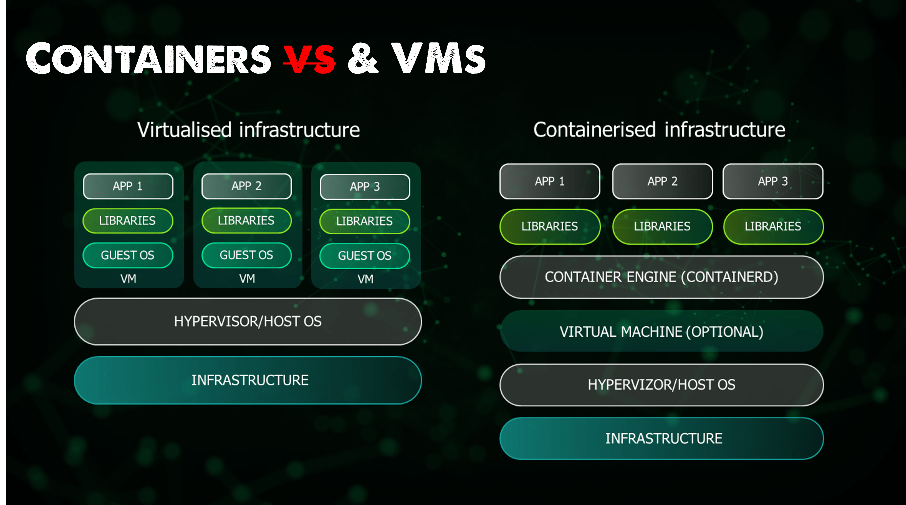

# Containers

Containers are a lightweight alternative to running whole virtualized environments via a hypervisor due to sharing
concepts of underlying resources.

## What is a container?

Applications, which can started via clicking on Application icons or via executing the application binary in a terminal,
run on computers as processes. Containers are also processes. A container is however moreover a standard unit of
software that packages up code and all its dependencies so the application runs quickly and reliably from one computing
environment to another. Containerised software will always run the same, regardless of the infrastructure. Containers
isolate software from its environment and ensure that it works uniformly despite differences for instance between
development and staging. Thus, normal application must be built for e.g. MacOS or Linux, Container however are not bound
to that but solely bundled in their images.

## What is an image?

A container image is a lightweight, standalone, executable package of software that includes everything needed to run an
application: code, runtime, system tools, system libraries and settings. Container images become containers at runtime.

## Docker

Docker is a software framework for building, running, and managing containers. The term "docker" may refer to either the
tools (the commands and a daemon) or to the Dockerfile file format.

### Docker Engine

Docker Engine is an open source containerization technology for building and containerizing your applications. Docker
Engine acts as a client-server application with:

A server with a long-running daemon process dockerd. APIs which specify interfaces that programs can use to talk to and
instruct the Docker daemon. A command line interface (CLI) client docker.

### Docker Desktop

We have a docker desktop for both Windows and macOS systems. An easy to install, lightweight docker development
environment. A native OS application that leverages virtualisation capabilities on the host operating system.

### Docker Compose

Docker compose is a tool that allows you to run more complex apps over multiple containers. With the benefit of being
able to use a single file and command to spin up your application.

### Docker Hub

A centralised resource for working with Docker and its components. Most commonly known as a registry to host docker
images.

### Dockerfile

A dockerfile is a text file that contains commands you would normally execute manually in order to build a docker image.
Docker can build images automatically by reading the instructions we have in our dockerfile.

#### Commands

Dockerfile consists of specific layers all representing a command which mutates a base image in some ways. One can e.g.
install more software, create or copy files and much more in these layers.

| Command      | Purpose                                                                                        |
|--------------|------------------------------------------------------------------------------------------------|
| `FROM`       | Image Parent                                                                                   |
| `WORKDIR`    | Set working directory for all following commands                                               |
| `RUN`        | Install any further apps and packages                                                          |
| `COPY`       | Copy over files from specified local directory                                                 |
| `ADD`        | As COPY, but also able to handle remote URLs and unpack compressed files                       |
| `ENTRYPOINT` | Starting command being executed on container start. Defaults to /bin/sh -c when not specified. |
| `EXPOSE`     | Expose ports of the container to access its applications                                       |
| `LABEL`      | Metadata                                                                                       |